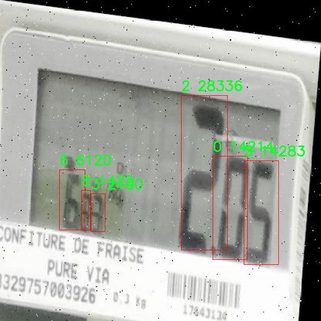

# 仪器数码管数字识别检测系统源码分享
 # [一条龙教学YOLOV8标注好的数据集一键训练_70+全套改进创新点发刊_Web前端展示]

### 1.研究背景与意义

项目参考[AAAI Association for the Advancement of Artificial Intelligence](https://gitee.com/qunmasj/projects)

项目来源[AACV Association for the Advancement of Computer Vision](https://kdocs.cn/l/cszuIiCKVNis)

研究背景与意义

随着科技的迅猛发展，数字化仪器在各个领域的应用日益广泛，尤其是在工业自动化、医疗设备和智能家居等领域，数字显示器的使用频率显著增加。数字管显示器，尤其是七段显示器，以其直观的数字显示形式，成为了信息传递的重要媒介。然而，传统的数字识别方法往往依赖于复杂的图像处理算法，难以在多变的环境中保持高效的识别精度。因此，基于深度学习的数字识别技术应运而生，成为解决这一问题的有效手段。

YOLO（You Only Look Once）系列模型以其高效的实时目标检测能力，逐渐成为计算机视觉领域的研究热点。特别是YOLOv8模型，凭借其更高的检测精度和更快的推理速度，展现出了在多种应用场景中的广泛适用性。通过对YOLOv8模型的改进，能够进一步提升其在数字管识别任务中的表现，尤其是在复杂背景、光照变化和不同角度等挑战性条件下的识别能力。

本研究的核心在于构建一个基于改进YOLOv8的仪器数码管数字识别系统，旨在通过深度学习技术实现对七段数字显示的高效、准确识别。为此，我们使用了一个包含1500张图像的数据集，涵盖了0到9的10个类别。该数据集不仅为模型的训练提供了丰富的样本，还为后续的模型评估和优化奠定了基础。通过对该数据集的深入分析，我们能够识别出数字显示中的常见问题，如模糊、遮挡和背景干扰等，从而针对性地改进模型结构和训练策略。

研究的意义在于，首先，基于改进YOLOv8的数字识别系统将为工业自动化和智能设备的智能化升级提供技术支持。通过实现对数字管的快速识别，能够有效提高设备的自动化水平，减少人工干预，提高生产效率。其次，该系统的成功应用将为其他领域的数字识别提供借鉴，推动计算机视觉技术在更广泛的应用场景中的发展。此外，研究过程中积累的数据集和模型优化经验，也将为后续的研究者提供宝贵的参考资料，促进相关领域的学术交流与合作。

综上所述，基于改进YOLOv8的仪器数码管数字识别系统不仅具有重要的理论价值，也具备广泛的实际应用前景。通过深入探索数字识别技术的创新与应用，能够为智能化时代的到来提供强有力的技术支撑，推动社会各领域的智能化进程。

### 2.图片演示


##### 注意：由于此博客编辑较早，上面“2.图片演示”和“3.视频演示”展示的系统图片或者视频可能为老版本，新版本在老版本的基础上升级如下：（实际效果以升级的新版本为准）

  （1）适配了YOLOV8的“目标检测”模型和“实例分割”模型，通过加载相应的权重（.pt）文件即可自适应加载模型。

  （2）支持“图片识别”、“视频识别”、“摄像头实时识别”三种识别模式。

  （3）支持“图片识别”、“视频识别”、“摄像头实时识别”三种识别结果保存导出，解决手动导出（容易卡顿出现爆内存）存在的问题，识别完自动保存结果并导出到tempDir中。

  （4）支持Web前端系统中的标题、背景图等自定义修改，后面提供修改教程。

  另外本项目提供训练的数据集和训练教程,暂不提供权重文件（best.pt）,需要您按照教程进行训练后实现图片演示和Web前端界面演示的效果。

### 3.视频演示

[3.1 视频演示](https://www.bilibili.com/video/BV12pxveNE2a/)

### 4.数据集信息展示

##### 4.1 本项目数据集详细数据（类别数＆类别名）

nc: 10
names: ['0', '1', '2', '3', '4', '5', '6', '7', '8', '9']


##### 4.2 本项目数据集信息介绍

数据集信息展示

在本研究中，我们使用了名为“7Segment”的数据集，以支持对YOLOv8模型的改进，旨在提升仪器数码管数字识别系统的性能。该数据集专门设计用于数字识别任务，包含了从0到9的十个类别，具体类别列表为：‘0’, ‘1’, ‘2’, ‘3’, ‘4’, ‘5’, ‘6’, ‘7’, ‘8’, ‘9’。这些类别涵盖了数字识别的基本需求，能够有效地支持多种应用场景，包括但不限于仪器仪表的读数、智能家居设备的状态显示以及工业自动化中的实时监控。

“7Segment”数据集的构建考虑到了数字识别的多样性和复杂性。数据集中包含了大量的图像样本，这些样本在不同的光照条件、角度和背景下捕捉了数码管的显示状态。这种多样性确保了模型在训练过程中能够学习到更为丰富的特征，从而在实际应用中具备更强的鲁棒性和准确性。数据集中的每个类别均包含了大量的标注图像，这些图像经过精确的标注，确保了每个数字的边界框和类别信息的准确性，为模型的训练提供了可靠的基础。

在数字识别的任务中，数码管的显示方式通常具有一定的规律性，但在实际应用中，由于环境因素的影响，可能会出现模糊、遮挡或反射等问题。因此，数据集中的图像样本不仅包括了标准的数码管显示，还涵盖了各种可能的干扰因素。这种设计理念旨在增强模型的适应能力，使其能够在复杂的环境中依然保持高效的识别性能。

此外，数据集的规模和多样性也为模型的泛化能力提供了保障。通过对“7Segment”数据集的充分利用，YOLOv8模型能够在训练过程中不断调整和优化其参数，以适应不同的输入数据。模型在经过充分训练后，能够在实际应用中快速、准确地识别出数码管上显示的数字，从而实现高效的自动化识别。

为了进一步提升模型的性能，我们还将对数据集进行数据增强处理，包括旋转、缩放、翻转等操作，以生成更多的训练样本。这种方法不仅能够增加数据集的多样性，还能有效防止模型的过拟合现象，使其在面对未知数据时依然能够保持良好的识别能力。

总之，“7Segment”数据集为改进YOLOv8的仪器数码管数字识别系统提供了坚实的基础。通过对该数据集的深入分析和应用，我们期望能够实现更高的识别准确率和更快的处理速度，从而推动数字识别技术在各个领域的广泛应用。随着技术的不断进步和数据集的不断优化，我们相信这一系统将在未来的智能化设备中发挥重要作用，为用户提供更加便捷和高效的服务。




### 5.全套项目环境部署视频教程（零基础手把手教学）

[5.1 环境部署教程链接（零基础手把手教学）](https://www.ixigua.com/7404473917358506534?logTag=c807d0cbc21c0ef59de5)


[5.2 安装Python虚拟环境创建和依赖库安装视频教程链接（零基础手把手教学）](https://www.ixigua.com/7404474678003106304?logTag=1f1041108cd1f708b01a)

### 6.手把手YOLOV8训练视频教程（零基础小白有手就能学会）

[6.1 手把手YOLOV8训练视频教程（零基础小白有手就能学会）](https://www.ixigua.com/7404477157818401292?logTag=d31a2dfd1983c9668658)

### 7.70+种全套YOLOV8创新点代码加载调参视频教程（一键加载写好的改进模型的配置文件）

[7.1 70+种全套YOLOV8创新点代码加载调参视频教程（一键加载写好的改进模型的配置文件）](https://www.ixigua.com/7404478314661806627?logTag=29066f8288e3f4eea3a4)

### 8.70+种全套YOLOV8创新点原理讲解（非科班也可以轻松写刊发刊，V10版本正在科研待更新）

由于篇幅限制，每个创新点的具体原理讲解就不一一展开，具体见下列网址中的创新点对应子项目的技术原理博客网址【Blog】：


[8.1 70+种全套YOLOV8创新点原理讲解链接](https://gitee.com/qunmasj/good)

### 9.系统功能展示（检测对象为举例，实际内容以本项目数据集为准）

图9.1.系统支持检测结果表格显示

  图9.2.系统支持置信度和IOU阈值手动调节

  图9.3.系统支持自定义加载权重文件best.pt(需要你通过步骤5中训练获得)

  图9.4.系统支持摄像头实时识别

  图9.5.系统支持图片识别

  图9.6.系统支持视频识别

  图9.7.系统支持识别结果文件自动保存

  图9.8.系统支持Excel导出检测结果数据


### 10.原始YOLOV8算法原理

原始YOLOv8算法原理

YOLOv8作为目标检测领域的最新进展，继承并优化了YOLO系列模型的核心思想，特别是在YOLOv5和YOLOv7的基础上进行了重要的改进。该算法的设计目标是实现高效、准确的目标检测，尤其是在资源受限的环境中。YOLOv8的网络结构主要由输入层、主干网络、特征融合层和检测头组成，每个部分都经过精心设计，以提高模型的性能和灵活性。

在输入层，YOLOv8首先对输入图像进行缩放，以适应模型所需的输入尺寸。此步骤确保了图像的尺寸一致性，从而为后续的特征提取打下基础。接下来，主干网络通过一系列卷积操作对图像进行下采样，以提取出图像的特征。YOLOv8在主干网络中采用了C2f模块，该模块的设计灵感来源于YOLOv7中的E-ELAN结构，旨在通过跨层分支连接来增强模型的梯度流。这种设计不仅提升了特征提取的效率，还改善了检测结果的准确性。

C2f模块的构建由多个CBS（卷积+批归一化+SiLU激活函数）组成，具有良好的特征抽象能力。通过在网络中引入多个分支，C2f模块能够有效地捕捉不同层次的特征信息，并通过特征的叠加实现更丰富的特征表达。此外，YOLOv8在主干网络的末尾引入了SPP（Spatial Pyramid Pooling）模块，通过多个最大池化层来处理多尺度特征，进一步增强了网络的特征提取能力。

特征融合层是YOLOv8的重要组成部分，采用了PAN（Path Aggregation Network）和FPN（Feature Pyramid Network）的结合，以实现多尺度特征的高效融合。特征融合层的设计使得网络能够充分利用不同尺度的特征信息，从而提高目标检测的准确性和鲁棒性。在此基础上，YOLOv8还引入了BiFPN（Bidirectional Feature Pyramid Network），通过高效的双向跨尺度连接和加权特征融合，进一步提升了模型对不同尺度特征信息的提取速度和准确性。

在检测头部分，YOLOv8采用了解耦的检测头结构，取消了传统的Anchor-Based方法，转而使用Anchor-Free的思想。这一转变使得模型在处理目标检测时更加灵活，能够更好地适应不同类型的目标。此外，YOLOv8在损失函数的设计上也进行了创新，采用了VFLLoss作为分类损失，并结合DFLLoss和CIoULoss来优化回归损失。这种损失函数的组合不仅提高了模型的学习效率，还有效解决了样本不平衡的问题。

在样本匹配策略方面，YOLOv8从静态匹配转变为Task-Aligned的Assigner匹配方式，这一变化使得模型在训练过程中能够更好地适应不同任务的需求，提升了检测的精度和速度。通过这种动态匹配策略，YOLOv8能够更有效地处理不同类别和尺度的目标，提高了模型的整体性能。

值得一提的是，YOLOv8在数据预处理方面也采用了YOLOv5的策略，结合了马赛克增强、混合增强、空间扰动和颜色扰动等多种数据增强手段。这些增强手段不仅丰富了训练数据集，还有效提高了模型的泛化能力，使得YOLOv8在面对复杂场景时依然能够保持良好的检测性能。

综上所述，YOLOv8通过对主干网络、特征融合层和检测头的全面优化，结合创新的损失函数和样本匹配策略，成功实现了目标检测的高效性和准确性。其轻量化设计使得模型在资源受限的环境中也能高效运行，广泛适用于实时目标检测任务。随着YOLOv8的推出，目标检测技术将迎来新的发展机遇，为各类应用场景提供更为强大的支持。


### 11.项目核心源码讲解（再也不用担心看不懂代码逻辑）

#### 11.1 70+种YOLOv8算法改进源码大全和调试加载训练教程（非必要）\ultralytics\models\fastsam\predict.py

以下是对代码的核心部分进行分析和详细注释的结果：

```python
# 引入必要的库
import torch
from ultralytics.engine.results import Results
from ultralytics.models.fastsam.utils import bbox_iou
from ultralytics.models.yolo.detect.predict import DetectionPredictor
from ultralytics.utils import DEFAULT_CFG, ops

class FastSAMPredictor(DetectionPredictor):
    """
    FastSAMPredictor 类专门用于在 Ultralytics YOLO 框架中进行快速 SAM（Segment Anything Model）分割预测任务。

    该类扩展了 DetectionPredictor，定制了预测管道，特别针对快速 SAM。它调整了后处理步骤，以结合掩码预测和非最大抑制，同时优化单类分割。
    """

    def __init__(self, cfg=DEFAULT_CFG, overrides=None, _callbacks=None):
        """
        初始化 FastSAMPredictor 类，继承自 DetectionPredictor，并将任务设置为 'segment'。

        参数:
            cfg (dict): 预测的配置参数。
            overrides (dict, optional): 可选的参数覆盖，用于自定义行为。
            _callbacks (dict, optional): 可选的回调函数列表，在预测过程中调用。
        """
        super().__init__(cfg, overrides, _callbacks)  # 调用父类构造函数
        self.args.task = 'segment'  # 设置任务为分割

    def postprocess(self, preds, img, orig_imgs):
        """
        对预测结果进行后处理，包括非最大抑制和将框缩放到原始图像大小，并返回最终结果。

        参数:
            preds (list): 模型的原始输出预测。
            img (torch.Tensor): 处理后的图像张量。
            orig_imgs (list | torch.Tensor): 原始图像或图像列表。

        返回:
            (list): 包含处理后的框、掩码和其他元数据的 Results 对象列表。
        """
        # 执行非最大抑制，过滤掉低置信度的预测
        p = ops.non_max_suppression(
            preds[0],
            self.args.conf,
            self.args.iou,
            agnostic=self.args.agnostic_nms,
            max_det=self.args.max_det,
            nc=1,  # 设置为 1 类，因为 SAM 没有类预测
            classes=self.args.classes)

        # 创建一个全框，包含图像的宽高信息
        full_box = torch.zeros(p[0].shape[1], device=p[0].device)
        full_box[2], full_box[3], full_box[4], full_box[6:] = img.shape[3], img.shape[2], 1.0, 1.0
        full_box = full_box.view(1, -1)

        # 计算与全框的 IoU，并更新框信息
        critical_iou_index = bbox_iou(full_box[0][:4], p[0][:, :4], iou_thres=0.9, image_shape=img.shape[2:])
        if critical_iou_index.numel() != 0:
            full_box[0][4] = p[0][critical_iou_index][:, 4]
            full_box[0][6:] = p[0][critical_iou_index][:, 6:]
            p[0][critical_iou_index] = full_box  # 更新预测框

        # 将输入图像转换为 numpy 格式（如果不是列表）
        if not isinstance(orig_imgs, list):
            orig_imgs = ops.convert_torch2numpy_batch(orig_imgs)

        results = []  # 存储最终结果
        proto = preds[1][-1] if len(preds[1]) == 3 else preds[1]  # 获取掩码原型

        # 遍历每个预测结果
        for i, pred in enumerate(p):
            orig_img = orig_imgs[i]  # 获取原始图像
            img_path = self.batch[0][i]  # 获取图像路径

            if not len(pred):  # 如果没有预测框
                masks = None
            elif self.args.retina_masks:  # 如果使用视网膜掩码
                pred[:, :4] = ops.scale_boxes(img.shape[2:], pred[:, :4], orig_img.shape)  # 缩放框
                masks = ops.process_mask_native(proto[i], pred[:, 6:], pred[:, :4], orig_img.shape[:2])  # 处理掩码
            else:  # 否则处理常规掩码
                masks = ops.process_mask(proto[i], pred[:, 6:], pred[:, :4], img.shape[2:], upsample=True)  # 处理掩码
                pred[:, :4] = ops.scale_boxes(img.shape[2:], pred[:, :4], orig_img.shape)  # 缩放框

            # 将结果存储到 Results 对象中
            results.append(Results(orig_img, path=img_path, names=self.model.names, boxes=pred[:, :6], masks=masks))

        return results  # 返回处理后的结果列表
```

### 代码核心部分说明：
1. **类的定义**：`FastSAMPredictor` 继承自 `DetectionPredictor`，专门用于快速分割任务。
2. **初始化方法**：设置任务类型为分割，并调用父类的初始化方法。
3. **后处理方法**：对模型的预测结果进行后处理，包括非最大抑制、框的缩放和掩码的处理，最终返回包含预测结果的列表。

该文件是一个实现快速分割预测的Python程序，属于Ultralytics YOLO框架的一部分，专门用于快速SAM（Segment Anything Model）分割任务。程序中定义了一个名为`FastSAMPredictor`的类，该类继承自`DetectionPredictor`，并对预测流程进行了定制，以适应快速SAM的需求。

在类的构造函数中，初始化了预测所需的配置参数、可选的参数覆盖和回调函数。构造函数调用了父类的初始化方法，并将任务类型设置为“segment”，表明该类主要用于分割任务。

`postprocess`方法是该类的核心功能之一，负责对模型的原始输出进行后处理。该方法接收模型的预测结果、处理后的图像张量以及原始图像（或图像列表）作为输入。首先，它使用非极大值抑制（NMS）来过滤掉重叠的预测框，确保每个目标只保留一个框。此时，由于SAM模型没有类别预测，因此将类别数设置为1。

接下来，程序构建了一个全框（full_box），用于存储预测框的位置信息，并计算与原始图像的IOU（Intersection over Union）值，以确定哪些预测框是关键的。如果有预测框的IOU值超过0.9，则更新全框的信息。

然后，程序将原始图像转换为NumPy数组（如果输入的是张量而不是列表），以便后续处理。对于每个预测框，程序根据是否需要返回细化的掩码，选择不同的处理方式。最后，将处理后的结果（包括原始图像、路径、类别名称、预测框和掩码）封装成`Results`对象，并返回一个结果列表。

总的来说，该文件实现了一个高效的分割预测流程，结合了YOLO的检测能力和SAM的分割特性，旨在提高分割任务的速度和准确性。

#### 11.2 code\ultralytics\__init__.py

以下是代码中最核心的部分，并附上详细的中文注释：

```python
# 导入必要的库和模块
from ultralytics.models import YOLO  # 导入YOLO模型
from ultralytics.utils import SETTINGS as settings  # 导入设置配置
from ultralytics.utils.checks import check_yolo as checks  # 导入YOLO检查工具
from ultralytics.utils.downloads import download  # 导入下载工具

# 定义可导出的模块内容
__all__ = "YOLO", "checks", "download", "settings"
```

### 注释说明：
1. **导入库和模块**：
   - `from ultralytics.models import YOLO`：导入YOLO模型，这是一个用于目标检测的深度学习模型。
   - `from ultralytics.utils import SETTINGS as settings`：导入设置配置，通常用于管理模型和训练的参数。
   - `from ultralytics.utils.checks import check_yolo as checks`：导入YOLO检查工具，用于验证YOLO模型的正确性和完整性。
   - `from ultralytics.utils.downloads import download`：导入下载工具，通常用于下载预训练模型或数据集。

2. **定义可导出的模块内容**：
   - `__all__`：这个变量定义了当使用`from module import *`时，哪些模块内容是可以被导出的。在这里，导出了YOLO模型、检查工具、下载工具和设置配置。这样可以方便其他模块使用这些核心功能。

这个程序文件是Ultralytics YOLO库的初始化文件，主要用于定义库的版本以及导入和暴露一些关键的模块和功能。

首先，文件开头注释部分表明了该库的名称（Ultralytics YOLO）以及其许可证类型（AGPL-3.0）。接着，定义了一个名为`__version__`的变量，其值为"8.1.3"，表示当前库的版本号。

随后，文件通过`from`语句导入了多个模块和类。具体来说，它导入了数据探索器`Explorer`，以及几种模型，包括`RTDETR`、`SAM`、`YOLO`和`FastSAM`，还有`NAS`（神经架构搜索）。此外，还导入了一些实用工具，比如`SETTINGS`（设置）、`check_yolo`（检查YOLO相关的功能）和`download`（下载功能）。

最后，使用`__all__`变量来定义该模块公开的接口，列出了可以被外部访问的名称，包括版本号、各种模型、检查函数、下载功能、设置和数据探索器。这种做法有助于明确哪些部分是库的公共API，便于用户理解和使用。

总体来说，这个文件的主要作用是组织和管理Ultralytics YOLO库的核心组件，确保用户能够方便地访问和使用这些功能。

#### 11.3 ui.py

```python
import sys
import subprocess

def run_script(script_path):
    """
    使用当前 Python 环境运行指定的脚本。

    Args:
        script_path (str): 要运行的脚本路径

    Returns:
        None
    """
    # 获取当前 Python 解释器的路径
    python_path = sys.executable

    # 构建运行命令
    command = f'"{python_path}" -m streamlit run "{script_path}"'

    # 执行命令
    result = subprocess.run(command, shell=True)
    if result.returncode != 0:
        print("脚本运行出错。")


# 实例化并运行应用
if __name__ == "__main__":
    # 指定您的脚本路径
    script_path = "web.py"  # 这里可以直接指定脚本路径

    # 运行脚本
    run_script(script_path)
```

### 代码注释

1. **导入模块**：
   - `import sys`：导入系统相关的模块，用于获取当前 Python 解释器的路径。
   - `import subprocess`：导入子进程模块，用于在 Python 中执行外部命令。

2. **定义函数 `run_script`**：
   - 该函数接收一个参数 `script_path`，表示要运行的 Python 脚本的路径。
   - 函数内部首先获取当前 Python 解释器的路径，存储在 `python_path` 变量中。
   - 然后构建一个命令字符串 `command`，该命令使用当前 Python 解释器运行 `streamlit` 模块，并指定要运行的脚本。
   - 使用 `subprocess.run` 执行构建的命令。如果命令执行失败（返回码不为 0），则打印错误信息。

3. **主程序入口**：
   - `if __name__ == "__main__":`：确保该代码块仅在脚本直接运行时执行，而不是被导入时执行。
   - 在主程序中，指定要运行的脚本路径 `script_path`，这里直接使用 `"web.py"`。
   - 调用 `run_script` 函数，传入脚本路径以运行指定的脚本。

这个程序文件名为 `ui.py`，其主要功能是通过当前的 Python 环境来运行一个指定的脚本。代码中首先导入了必要的模块，包括 `sys`、`os` 和 `subprocess`，以及一个自定义的模块 `QtFusion.path` 中的 `abs_path` 函数。

在 `run_script` 函数中，首先定义了一个参数 `script_path`，它是要运行的脚本的路径。函数内部首先获取当前 Python 解释器的路径，使用 `sys.executable` 来实现。接着，构建一个命令字符串，该命令使用当前的 Python 解释器来运行 `streamlit`，并指定要运行的脚本路径。

随后，使用 `subprocess.run` 方法来执行构建好的命令。这个方法会在一个新的 shell 中运行命令，并等待其完成。如果脚本运行过程中出现错误，返回的 `returncode` 将不为零，程序会打印出“脚本运行出错”的提示信息。

在文件的最后部分，使用 `if __name__ == "__main__":` 来判断是否是直接运行该脚本。如果是，则指定要运行的脚本路径为 `web.py`，并调用 `run_script` 函数来执行该脚本。这里的 `abs_path` 函数用于获取 `web.py` 的绝对路径，确保脚本可以在任何工作目录下正确找到。

总体来说，这个程序的目的是提供一个简单的接口来运行 `streamlit` 应用，方便用户在当前 Python 环境中启动一个指定的 Web 应用脚本。

#### 11.4 train.py

以下是经过简化并添加详细中文注释的核心代码部分：

```python
import random
import numpy as np
import torch.nn as nn
from ultralytics.data import build_dataloader, build_yolo_dataset
from ultralytics.engine.trainer import BaseTrainer
from ultralytics.models import yolo
from ultralytics.nn.tasks import DetectionModel
from ultralytics.utils import LOGGER, RANK
from ultralytics.utils.torch_utils import de_parallel, torch_distributed_zero_first

class DetectionTrainer(BaseTrainer):
    """
    基于检测模型的训练类，继承自BaseTrainer类。
    """

    def build_dataset(self, img_path, mode="train", batch=None):
        """
        构建YOLO数据集。

        参数:
            img_path (str): 包含图像的文件夹路径。
            mode (str): 模式，`train`表示训练模式，`val`表示验证模式。
            batch (int, optional): 批次大小，适用于`rect`模式。默认为None。
        """
        gs = max(int(de_parallel(self.model).stride.max() if self.model else 0), 32)  # 获取模型的最大步幅
        return build_yolo_dataset(self.args, img_path, batch, self.data, mode=mode, rect=mode == "val", stride=gs)

    def get_dataloader(self, dataset_path, batch_size=16, rank=0, mode="train"):
        """构造并返回数据加载器。"""
        assert mode in ["train", "val"]  # 确保模式合法
        with torch_distributed_zero_first(rank):  # 仅在DDP中初始化数据集
            dataset = self.build_dataset(dataset_path, mode, batch_size)  # 构建数据集
        shuffle = mode == "train"  # 训练模式下打乱数据
        workers = self.args.workers if mode == "train" else self.args.workers * 2  # 设置工作线程数
        return build_dataloader(dataset, batch_size, workers, shuffle, rank)  # 返回数据加载器

    def preprocess_batch(self, batch):
        """对图像批次进行预处理，包括缩放和转换为浮点数。"""
        batch["img"] = batch["img"].to(self.device, non_blocking=True).float() / 255  # 将图像转换为浮点数并归一化
        if self.args.multi_scale:  # 如果启用多尺度
            imgs = batch["img"]
            sz = (
                random.randrange(self.args.imgsz * 0.5, self.args.imgsz * 1.5 + self.stride)
                // self.stride
                * self.stride
            )  # 随机选择新的尺寸
            sf = sz / max(imgs.shape[2:])  # 计算缩放因子
            if sf != 1:
                ns = [
                    math.ceil(x * sf / self.stride) * self.stride for x in imgs.shape[2:]
                ]  # 计算新的形状
                imgs = nn.functional.interpolate(imgs, size=ns, mode="bilinear", align_corners=False)  # 进行插值缩放
            batch["img"] = imgs  # 更新批次图像
        return batch

    def get_model(self, cfg=None, weights=None, verbose=True):
        """返回YOLO检测模型。"""
        model = DetectionModel(cfg, nc=self.data["nc"], verbose=verbose and RANK == -1)  # 创建检测模型
        if weights:
            model.load(weights)  # 加载权重
        return model

    def plot_training_samples(self, batch, ni):
        """绘制带有注释的训练样本。"""
        plot_images(
            images=batch["img"],
            batch_idx=batch["batch_idx"],
            cls=batch["cls"].squeeze(-1),
            bboxes=batch["bboxes"],
            paths=batch["im_file"],
            fname=self.save_dir / f"train_batch{ni}.jpg",
            on_plot=self.on_plot,
        )

    def plot_metrics(self):
        """从CSV文件中绘制指标。"""
        plot_results(file=self.csv, on_plot=self.on_plot)  # 保存结果图
```

### 代码核心部分解释：
1. **数据集构建** (`build_dataset`): 负责根据给定的图像路径和模式构建YOLO数据集，支持训练和验证模式。
2. **数据加载器** (`get_dataloader`): 构造数据加载器，负责批量读取数据，并根据模式决定是否打乱数据。
3. **批次预处理** (`preprocess_batch`): 对每个批次的图像进行预处理，包括归一化和可能的缩放。
4. **模型获取** (`get_model`): 创建并返回YOLO检测模型，支持加载预训练权重。
5. **绘制训练样本** (`plot_training_samples`): 将训练样本及其注释可视化，便于观察训练效果。
6. **绘制指标** (`plot_metrics`): 从CSV文件中提取并绘制训练过程中的指标，以便分析模型性能。

这个程序文件 `train.py` 是一个用于训练目标检测模型的脚本，特别是基于 YOLO（You Only Look Once）架构的模型。它继承自 `BaseTrainer` 类，提供了一系列用于构建数据集、加载数据、预处理图像、设置模型属性和进行训练的功能。

在文件开头，导入了一些必要的库和模块，包括数学运算、随机数生成、深度学习框架 PyTorch 的神经网络模块，以及 Ultralytics 提供的各种工具和功能。这些工具包括数据加载器、模型构建、日志记录、图像绘制等。

`DetectionTrainer` 类是该文件的核心，提供了训练目标检测模型所需的各种方法。首先，`build_dataset` 方法用于构建 YOLO 数据集，接收图像路径、模式（训练或验证）和批次大小作为参数。它会根据模型的步幅计算合适的大小，并调用 `build_yolo_dataset` 函数来创建数据集。

`get_dataloader` 方法则用于构建数据加载器，确保在分布式训练时只初始化一次数据集。它会根据模式决定是否打乱数据，并设置工作线程的数量。通过调用 `build_dataloader` 函数，返回一个可用于训练或验证的数据加载器。

在图像预处理方面，`preprocess_batch` 方法负责将图像批次进行缩放和转换为浮点数。它支持多尺度训练，通过随机选择图像大小并进行插值处理，确保输入图像符合模型的要求。

`set_model_attributes` 方法用于设置模型的属性，包括类别数量和类别名称，以便模型能够正确识别不同的目标。

`get_model` 方法返回一个 YOLO 检测模型实例，并可选择加载预训练权重。`get_validator` 方法则返回一个用于模型验证的检测验证器，记录损失名称以便后续分析。

`label_loss_items` 方法用于返回带有标签的训练损失项字典，便于在训练过程中跟踪损失情况。`progress_string` 方法生成一个格式化的字符串，显示训练进度，包括当前的轮次、GPU 内存使用情况、损失值、实例数量和图像大小。

此外，`plot_training_samples` 方法用于绘制训练样本及其标注，便于可视化训练过程中的数据。`plot_metrics` 和 `plot_training_labels` 方法则用于绘制训练过程中的各种指标和标签，以便于分析模型的性能。

总体来说，这个程序文件为 YOLO 模型的训练提供了全面的支持，涵盖了数据处理、模型构建、训练过程监控和结果可视化等多个方面。

#### 11.5 70+种YOLOv8算法改进源码大全和调试加载训练教程（非必要）\ultralytics\utils\callbacks\comet.py

以下是代码中最核心的部分，并附上详细的中文注释：

```python
# 导入必要的库
from ultralytics.utils import LOGGER, RANK, SETTINGS, TESTS_RUNNING, ops
import os
from pathlib import Path

# 检查是否正在运行测试，并确保设置中启用了Comet集成
try:
    assert not TESTS_RUNNING  # 确保不在测试运行中
    assert SETTINGS['comet'] is True  # 确保Comet集成已启用
    import comet_ml  # 导入Comet库

    assert hasattr(comet_ml, '__version__')  # 确保comet_ml是一个有效的包

except (ImportError, AssertionError):
    comet_ml = None  # 如果导入失败，则将comet_ml设置为None

def _create_experiment(args):
    """在分布式训练中确保实验对象仅在单个进程中创建。"""
    if RANK not in (-1, 0):  # 仅在主进程中创建实验
        return
    try:
        comet_mode = _get_comet_mode()  # 获取Comet模式
        _project_name = os.getenv('COMET_PROJECT_NAME', args.project)  # 获取项目名称
        experiment = _get_experiment_type(comet_mode, _project_name)  # 创建实验对象
        experiment.log_parameters(vars(args))  # 记录参数
        # 记录其他设置
        experiment.log_others({
            'eval_batch_logging_interval': _get_eval_batch_logging_interval(),
            'log_confusion_matrix_on_eval': _should_log_confusion_matrix(),
            'log_image_predictions': _should_log_image_predictions(),
            'max_image_predictions': _get_max_image_predictions_to_log(),
        })
        experiment.log_other('Created from', 'yolov8')  # 记录创建来源

    except Exception as e:
        LOGGER.warning(f'WARNING ⚠️ Comet安装但未正确初始化，未记录此运行。 {e}')  # 记录警告信息

def on_train_epoch_end(trainer):
    """在训练周期结束时记录指标和保存批次图像。"""
    experiment = comet_ml.get_global_experiment()  # 获取全局实验对象
    if not experiment:
        return  # 如果实验对象不存在，则返回

    metadata = _fetch_trainer_metadata(trainer)  # 获取训练器元数据
    curr_epoch = metadata['curr_epoch']  # 当前周期
    curr_step = metadata['curr_step']  # 当前步骤

    # 记录训练指标
    experiment.log_metrics(
        trainer.label_loss_items(trainer.tloss, prefix='train'),
        step=curr_step,
        epoch=curr_epoch,
    )

    # 如果是第一个周期，记录训练批次图像
    if curr_epoch == 1:
        _log_images(experiment, trainer.save_dir.glob('train_batch*.jpg'), curr_step)

def on_train_end(trainer):
    """在训练结束时执行操作。"""
    experiment = comet_ml.get_global_experiment()  # 获取全局实验对象
    if not experiment:
        return  # 如果实验对象不存在，则返回

    metadata = _fetch_trainer_metadata(trainer)  # 获取训练器元数据
    curr_epoch = metadata['curr_epoch']  # 当前周期
    curr_step = metadata['curr_step']  # 当前步骤

    _log_model(experiment, trainer)  # 记录最佳训练模型
    _log_confusion_matrix(experiment, trainer, curr_step, curr_epoch)  # 记录混淆矩阵
    _log_image_predictions(experiment, trainer.validator, curr_step)  # 记录图像预测
    experiment.end()  # 结束实验

# 回调函数字典
callbacks = {
    'on_train_epoch_end': on_train_epoch_end,
    'on_train_end': on_train_end
} if comet_ml else {}
```

### 代码核心部分说明：
1. **导入库和初始化**：导入必要的库，并检查Comet集成是否已启用。
2. **创建实验**：在分布式训练中，确保实验对象仅在主进程中创建，并记录相关参数和设置。
3. **训练周期结束**：在每个训练周期结束时，记录训练指标和批次图像。
4. **训练结束**：在训练结束时，记录最佳模型、混淆矩阵和图像预测，并结束实验。
5. **回调函数**：定义了在训练过程中需要调用的回调函数，以便在适当的时机记录信息。

这个程序文件是用于YOLOv8算法在训练过程中与Comet.ml进行集成的工具代码。Comet.ml是一个用于机器学习实验管理和可视化的平台。文件中包含了一系列函数和回调，用于在训练过程中记录和管理实验数据。

首先，文件通过导入必要的库和模块来进行初始化，并确保在测试运行时不进行日志记录。它检查环境变量，以确认Comet集成是否启用，并验证comet_ml包的版本。

接下来，定义了一些辅助函数，这些函数用于获取环境变量中的配置，例如Comet的模式、模型名称、评估批次日志记录间隔、最大图像预测数量等。这些配置帮助用户根据自己的需求定制日志记录行为。

文件中还定义了一些用于处理图像和标签的函数。例如，`_scale_bounding_box_to_original_image_shape`函数用于将YOLOv8在训练过程中调整后的边界框标签重新缩放到原始图像的形状。`_format_ground_truth_annotations_for_detection`和`_format_prediction_annotations_for_detection`函数则分别用于格式化真实标签和模型预测的结果，以便于记录和可视化。

在训练过程中，文件会根据配置记录混淆矩阵、图像预测和评估图表。通过`_log_confusion_matrix`和`_log_images`等函数，程序能够将这些信息上传到Comet实验中，以便后续分析。

文件还定义了一些回调函数，这些函数在训练的不同阶段被调用。例如，`on_pretrain_routine_start`在预训练开始时创建或恢复Comet实验，`on_train_epoch_end`在每个训练周期结束时记录指标和保存图像，`on_fit_epoch_end`在每个适应周期结束时记录模型资产，`on_train_end`在训练结束时执行清理操作。

最后，所有的回调函数被组织成一个字典，便于在训练过程中根据需要调用。整体而言，这个文件为YOLOv8的训练过程提供了一个强大的日志记录和实验管理功能，使得用户能够更好地监控和分析他们的模型训练过程。

#### 11.6 70+种YOLOv8算法改进源码大全和调试加载训练教程（非必要）\ultralytics\nn\extra_modules\ops_dcnv3\modules\dcnv3.py

以下是提取出的核心代码部分，并附上详细的中文注释：

```python
import torch
from torch import nn
import torch.nn.functional as F
from torch.nn.init import xavier_uniform_, constant_

class DCNv3(nn.Module):
    def __init__(self, channels=64, kernel_size=3, stride=1, pad=1, dilation=1, group=4, offset_scale=1.0, center_feature_scale=False, remove_center=False):
        """
        DCNv3模块的初始化函数
        :param channels: 输入通道数
        :param kernel_size: 卷积核大小
        :param stride: 步幅
        :param pad: 填充
        :param dilation: 膨胀
        :param group: 分组数
        :param offset_scale: 偏移缩放因子
        :param center_feature_scale: 是否使用中心特征缩放
        :param remove_center: 是否移除中心
        """
        super().__init__()
        # 检查通道数是否能被分组数整除
        if channels % group != 0:
            raise ValueError(f'channels must be divisible by group, but got {channels} and {group}')
        
        self.channels = channels
        self.kernel_size = kernel_size
        self.stride = stride
        self.dilation = dilation
        self.pad = pad
        self.group = group
        self.group_channels = channels // group
        self.offset_scale = offset_scale
        self.center_feature_scale = center_feature_scale
        self.remove_center = int(remove_center)

        # 定义卷积层、偏移量线性层和掩码线性层
        self.dw_conv = nn.Conv2d(channels, channels, kernel_size, stride=1, padding=(kernel_size - 1) // 2, groups=channels)
        self.offset = nn.Linear(channels, group * (kernel_size * kernel_size - remove_center) * 2)
        self.mask = nn.Linear(channels, group * (kernel_size * kernel_size - remove_center))
        self.input_proj = nn.Linear(channels, channels)
        self.output_proj = nn.Linear(channels, channels)
        self._reset_parameters()  # 初始化参数

        # 如果启用中心特征缩放，定义相关参数
        if center_feature_scale:
            self.center_feature_scale_proj_weight = nn.Parameter(torch.zeros((group, channels), dtype=torch.float))
            self.center_feature_scale_proj_bias = nn.Parameter(torch.tensor(0.0, dtype=torch.float).view((1,)).repeat(group, ))

    def _reset_parameters(self):
        """重置网络参数"""
        constant_(self.offset.weight.data, 0.)
        constant_(self.offset.bias.data, 0.)
        constant_(self.mask.weight.data, 0.)
        constant_(self.mask.bias.data, 0.)
        xavier_uniform_(self.input_proj.weight.data)
        constant_(self.input_proj.bias.data, 0.)
        xavier_uniform_(self.output_proj.weight.data)
        constant_(self.output_proj.bias.data, 0.)

    def forward(self, input):
        """
        前向传播函数
        :param input: 输入张量，形状为 (N, H, W, C)
        :return: 输出张量，形状为 (N, H, W, C)
        """
        N, H, W, _ = input.shape  # 获取输入的形状

        x = self.input_proj(input)  # 输入投影
        x_proj = x  # 保存输入投影以备后用

        x1 = input.permute(0, 3, 1, 2)  # 将输入的通道维度移到前面
        x1 = self.dw_conv(x1).permute(0, 2, 3, 1)  # 深度卷积操作
        offset = self.offset(x1)  # 计算偏移量
        mask = self.mask(x1).reshape(N, H, W, self.group, -1)  # 计算掩码
        mask = F.softmax(mask, -1)  # 对掩码进行softmax归一化

        # 应用DCNv3操作
        x = DCNv3Function.apply(
            x.permute(0, 2, 3, 1).contiguous(), offset.contiguous(), mask.contiguous(),
            self.kernel_size, self.kernel_size,
            self.stride, self.stride,
            self.pad, self.pad,
            self.dilation, self.dilation,
            self.group, self.group_channels,
            self.offset_scale,
            256,
            self.remove_center)

        # 如果启用中心特征缩放，进行相应的处理
        if self.center_feature_scale:
            center_feature_scale = self.center_feature_scale_proj_weight @ x1 + self.center_feature_scale_proj_bias
            center_feature_scale = center_feature_scale[..., None].repeat(1, 1, 1, 1, self.channels // self.group).flatten(-2)
            x = x * (1 - center_feature_scale) + x_proj * center_feature_scale  # 结合输入和输出

        x = self.output_proj(x)  # 输出投影
        return x.permute(0, 2, 3, 1)  # 返回输出，恢复通道维度
```

### 代码注释说明：
1. **类定义**：`DCNv3`类是一个深度可分离卷积模块的实现，主要用于图像处理任务。
2. **初始化函数**：在构造函数中定义了卷积层、线性层和其他参数，并进行了必要的参数初始化。
3. **前向传播**：在`forward`方法中，输入数据经过一系列的线性变换和卷积操作，最后输出经过处理的特征图。
4. **参数重置**：`_reset_parameters`方法用于初始化网络中的权重和偏置，确保网络在训练开始时的状态是合理的。

这个程序文件实现了一个名为DCNv3的深度学习模块，主要用于计算机视觉任务中的卷积操作。文件开头包含了一些版权信息和导入的库。接下来，程序定义了一些辅助类和函数，帮助构建和使用DCNv3模块。

首先，`to_channels_first`和`to_channels_last`类用于在不同的通道格式之间转换数据。`to_channels_first`将输入的张量从“通道最后”格式转换为“通道第一”格式，而`to_channels_last`则相反。这在处理不同格式的数据时非常有用。

`build_norm_layer`函数用于构建归一化层，可以选择批归一化（Batch Normalization）或层归一化（Layer Normalization），并根据输入和输出格式进行适当的转换。`build_act_layer`函数则用于构建激活函数层，支持ReLU、SiLU和GELU等激活函数。

`_is_power_of_2`函数用于检查一个数是否是2的幂，这在设置通道数时是一个性能优化的建议。

`CenterFeatureScaleModule`类实现了一个中心特征缩放模块，用于调整特征图的尺度。

`DCNv3_pytorch`类是DCNv3模块的核心实现，构造函数中定义了模块的各个参数，如通道数、卷积核大小、步幅、填充、扩张、分组等。它还包含了深度可分离卷积（depthwise convolution）、偏移量（offset）和掩码（mask）的线性层。`_reset_parameters`方法用于初始化模型参数。

在`forward`方法中，输入数据经过一系列线性变换和卷积操作，最终输出处理后的特征图。该方法中还包含了对中心特征缩放的处理。

`DCNv3`类是DCNv3模块的另一种实现，主要区别在于使用了不同的卷积实现（`Conv`类）。它同样定义了各个参数，并在`forward`方法中实现了与`DCNv3_pytorch`类似的功能。

`DCNv3_DyHead`类是DCNv3模块的动态头实现，主要用于处理输入数据并输出结果。它与之前的类类似，但省略了一些不必要的层，并直接在`forward`方法中实现了DCNv3的核心计算。

总体来说，这个文件实现了DCNv3模块的多个变体，提供了灵活的构建和使用方式，适用于不同的计算机视觉任务。

### 12.系统整体结构（节选）

### 整体功能和构架概括

该项目是一个基于YOLOv8的计算机视觉框架，旨在提供高效的目标检测和分割功能。项目包含多个模块，涵盖了从数据加载、模型训练、预测到结果可视化的完整流程。主要功能包括：

1. **数据处理**：提供数据加载和预处理功能，支持多种数据格式和增强技术。
2. **模型构建**：实现了YOLOv8及其变体的模型架构，支持不同的网络模块和操作。
3. **训练和验证**：提供训练和验证的回调机制，支持实验管理和性能监控。
4. **预测和推理**：实现了快速推理功能，支持图像分割和目标检测。
5. **可视化和日志记录**：集成了Comet.ml等工具，方便用户记录实验过程和结果。

### 文件功能整理表

| 文件路径                                                                                                   | 功能描述                                                                                                                                                   |
|----------------------------------------------------------------------------------------------------------|----------------------------------------------------------------------------------------------------------------------------------------------------------|
| `C:\shangjia\code\70+种YOLOv8算法改进源码大全和调试加载训练教程（非必要）\ultralytics\models\fastsam\predict.py` | 实现快速分割预测，定义`FastSAMPredictor`类，处理模型输出，执行非极大值抑制，并返回预测结果。                                                              |
| `C:\shangjia\code\code\ultralytics\__init__.py`                                                         | 初始化Ultralytics YOLO库，定义版本号，导入核心模块和功能，设置公共API。                                                                                  |
| `C:\shangjia\code\ui.py`                                                                                 | 提供一个接口来运行指定的Streamlit脚本，便于用户启动Web应用。                                                                                             |
| `C:\shangjia\code\train.py`                                                                              | 实现YOLO模型的训练过程，包含数据集构建、数据加载、预处理、模型属性设置、训练监控和结果可视化等功能。                                                    |
| `C:\shangjia\code\70+种YOLOv8算法改进源码大全和调试加载训练教程（非必要）\ultralytics\utils\callbacks\comet.py` | 集成Comet.ml进行实验管理和日志记录，支持混淆矩阵、图像预测和评估图表的记录。                                                                             |
| `C:\shangjia\code\70+种YOLOv8算法改进源码大全和调试加载训练教程（非必要）\ultralytics\nn\extra_modules\ops_dcnv3\modules\dcnv3.py` | 实现DCNv3模块，提供深度可分离卷积和中心特征缩放功能，支持多种卷积操作。                                                                                  |
| `C:\shangjia\code\ultralytics\data\explorer\utils.py`                                                  | 提供数据探索和可视化的工具函数，帮助用户分析数据集。                                                                                                     |
| `C:\shangjia\code\ultralytics\data\loaders.py`                                                          | 实现数据加载器，支持多种数据格式和增强策略，确保训练过程中的数据流畅。                                                                                   |
| `C:\shangjia\code\__init__.py`                                                                           | 项目的初始化文件，可能包含一些全局配置和模块导入。                                                                                                       |
| `C:\shangjia\code\70+种YOLOv8算法改进源码大全和调试加载训练教程（非必要）\ultralytics\models\rtdetr\predict.py` | 实现RTDETR模型的预测功能，处理输入数据并返回检测结果。                                                                                                   |
| `C:\shangjia\code\70+种YOLOv8算法改进源码大全和调试加载训练教程（非必要）\ultralytics\nn\modules\head.py` | 定义YOLO模型的头部结构，处理最终的特征图并生成输出。                                                                                                     |
| `C:\shangjia\code\70+种YOLOv8算法改进源码大全和调试加载训练教程（非必要）\ultralytics\models\yolo\detect\__init__.py` | 初始化YOLO检测模块，提供检测功能的入口。                                                                                                                  |
| `C:\shangjia\code\70+种YOLOv8算法改进源码大全和调试加载训练教程（非必要）\ultralytics\models\yolo\pose\train.py` | 实现YOLO姿态估计模型的训练过程，类似于`train.py`，但专注于姿态估计任务。                                                                                 |

这个表格概述了项目中各个文件的功能，帮助用户快速理解每个模块的作用及其在整体架构中的位置。

注意：由于此博客编辑较早，上面“11.项目核心源码讲解（再也不用担心看不懂代码逻辑）”中部分代码可能会优化升级，仅供参考学习，完整“训练源码”、“Web前端界面”和“70+种创新点源码”以“13.完整训练+Web前端界面+70+种创新点源码、数据集获取”的内容为准。

### 13.完整训练+Web前端界面+70+种创新点源码、数据集获取


# [下载链接：https://mbd.pub/o/bread/ZpyUk5dy](https://mbd.pub/o/bread/ZpyUk5dy)